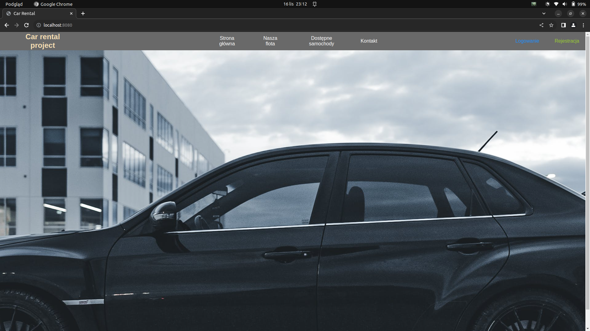
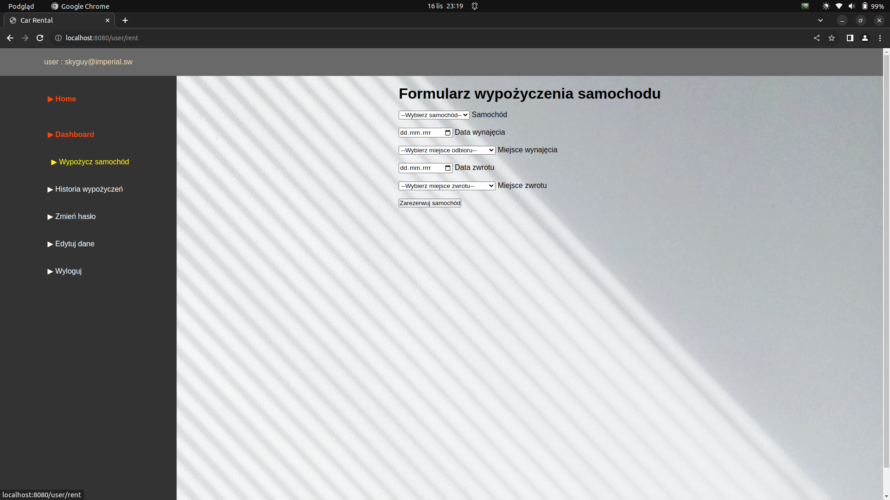

# CarRental - Simplify Your Ride!

# Descrption

CarRental is an open-source project designed to simplify the process of managing and renting vehicles. The platform is user-friendly not only for customers but also for employees and owners alike!

# Home Page

This is the main page of the website. There are three additional subpages that anyone can access - our fleet, available cars and contact. You can also register and log in to gain more accessibility.

## Our Fleet

These are all the cars that we offer. You can click on any of them to check opinions about it.

When you are logged in, you additionally gain the possibility to add opinions and ratings for cars you have rented. This will recalculate the car's average ratings for future guests to make it easier for them to choose a car.

## Available Cars

Whether you're logged in or not, you can check which cars from our offer are currently available. If you want to rent a car, you must register (more about this process in a moment).

## Contact

Here you will find all the necessary information about the company's management and contact details.

# Registration

Below is the registration form. Once you complete it correctly, you will gain access to your account and be able to continue using the application.

If you make a mistake, a window will appear, indicating where the error occurred.

Correct the incorrect fields, and you're all set. You have successfully registered!

# Login

Welcome to the login page. To access your account, enter your registered email and password in the form below.

If you enter incorrect data, a window will appear with instructions on what went wrong. Correct your data following the instructions to successfully log in to your account.

After a successful login, you will be redirected to the dashboard. Moreover, a new option will appear on the navigation bar on the home page, providing direct access to your dashboard.

# User Dashboard

After a successful login, you will be redirected to the dashboard. The main page displays all cars for which the rental process is in progress (cars you have not returned yet).

## Car Rental Form

Here, you can choose the car you'd like to rent, specify the rental duration, and select the pickup and return locations. After completion, the car will be marked as "reserved" until you return it. The return process can only be initiated by employees or admins.

## Rental History

In this section, you can easily review your history of rented cars with our company. Information includes the rented car, rental and return dates, city, street, price per day and the total amount paid for each rental.

## New Password

If you feel unsafe with your current password or simply want a change, you can set a new password using this form.

## Update User Data

If for any reason you need to change your name, surname, or email, this form allows you to do that in the blink of an eye ;)

## Logout

Once you've completed your tasks, you can log out - until next time! :)

# Admin Dashboard

The Admin Dashboard provides access to a comprehensive set of tools for managing and overseeing all company processes.

# Cars Management

This section provides an overview of all cars in the company, with a convenient pagination of 5 cars per page for better clarity. You have the option to delete or edit any car directly from this section.

## Add New Car

You can effortlessly add a new car using the car addition form available on this page.

If an issue arises, you will be notified by an annotation under the car addition form.

Simply follow the instructions, and everything will be alright! :)

## Edit Car

## Departments Management

In this section, you can seamlessly manage your company's departments. You have the option to add new departments or edit and delete existing ones.

## Add New Department

## Edit Department

When updating a department, you can specify details like city, street, building number, ZIP code, and phone number.

# Users Management

This panel provides access to all users registered on the portal, with pagination displaying 10 users per page for clarity. You can add new users or edit and delete existing ones.

## Add New User

## Edit User

## Search Users

You can search for users using their email. The results will display a list of users matching your search.

Now you can edit and delete the found users or proceed to the next search.

# Opinions Management

In this section, you have full control over managing opinions related to the company's cars. You can delete, edit or even create new opinions.

To enhance transparency, navigate to a dedicated page showing cars with reviews, allowing you to view opinions for each car.

Now, you can explore the details of any car on the list.

From this page, you can also delete and edit opinions.

## Add Opinion

## Edit Opinion

# Rent Management

Manage your company's car rental history from this page. You can create a new rental, update existing rentals, or end them (changing the vehicle status from "reserved" to "available" and the rental status from "process" to "ended"). Additionally, you can access detailed information, such as car or users details.

## Car Details

Explore all the details of a car by clicking the info button next to the car name.

## Add New Rent

Initiate a new rental process.

## Edit Rent

Make changes to an existing rental.

## Return Car

Complete the return process after the customer returns the car. Set the actual mileage (which cannot be less than the current mileage, as the system will prevent the process from being completed).

Once the process is completed, the car's mileage will be updated and the car will appear in the "available cars" section on the main page. At this point, the rental cannot be edited any further.

# Contact

If you have any questions, feedback or issues, feel free to reach out to me:

- Email: cezary.wozakowski@gmail.com
